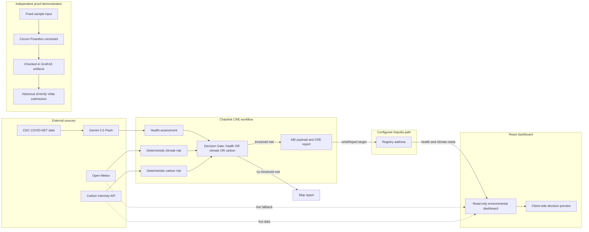

<div align="center">

# TerraGuardian

### Transparent environmental decision intelligence

TerraGuardian is the final project developed for the Encode Club Remix AI Bootcamp (Remix AI Bootcamp for Real World Impact).

TerraGuardian combines a Chainlink CRE workflow, a Solidity demonstration registry, a React dashboard, and a separate Groth16 submission example. The repository keeps those systems distinct: the current CRE workflow does not generate a proof, call zkVerify, or use a zkVerify result to authorize a Sepolia write.

**Link:terra-guardian.vercel.app**

[](contracts/HealthAlertRegistry.sol)
[](frontend/)
[](workflow-environmental-health-intelligence-agent/)
[](workflow-environmental-health-intelligence-agent/workflow.ts)
[](contracts/HealthAlertRegistry.sol)
[](zkverify/)

</div>
---

## Project status

The labels below describe repository evidence, not production readiness.

| Capability | Status | Repository evidence and boundary |
|---|---|---|
| CDC data request | Implemented | The CRE workflow requests three rows from CDC dataset `6jg4-xsqq`, a COVID-NET hospitalization-rate dataset. |
| Open-Meteo request | Implemented | The workflow requests current London temperature, relative humidity, 10 m wind speed, and UV index. |
| Carbon Intensity request | Implemented | The workflow requests current Great Britain grid-intensity data and uses actual, forecast, and index values. |
| Gemini analysis | Implemented | Gemini 2.5 Flash receives the CDC response and returns a structured health assessment that is parsed with Zod. Climate and carbon data are not sent to Gemini. |
| Deterministic Decision Gate | Implemented | Health, climate, and carbon-derived risk values are compared with explicit thresholds using an OR rule. |
| CRE report construction | Implemented in workflow code | The workflow ABI-encodes a health-alert payload and requests an ECDSA/Keccak CRE report. |
| Sepolia write | Configured code path | `writeReport` targets the configured Sepolia address when the gate passes. The repository does not include a CRE execution transaction proving that this path completed successfully. |
| Scheduled hosted CRE execution | Not evidenced | A ten-minute cron schedule and CRE configuration are checked in; continuous deployment or hosted execution is not claimed. |
| Solidity registry source | Implemented | The contract source defines append-only health, climate, and combined-decision record types with permissionless write functions. |
| Configured Sepolia registry | Configured address | The workflow and frontend use the same address. The repository does not include a deployment manifest that binds the current contract artifact to that address. |
| React dashboard | Implemented | The UI reads health and climate records through a public Sepolia RPC and requests live climate and carbon data without wallet approval. |
| Groth16 circuit | Implemented | The Circom circuit constrains one Poseidon preimage relation. |
| Proof artifacts | Checked in | A Groth16 proof, public signal, and verification key are present and can be verified locally with snarkjs. |
| Reproducible proof-generation workflow | Incomplete | The repository generates the sample input but does not include scripts for circuit compilation, trusted setup, witness generation, or proof generation. |
| zkVerify Volta submission | Historical artifact | A checked-in summary records one finalized verify-only submission. The React app displays a copy of this metadata. |
| CRE-to-zkVerify orchestration | Not implemented | `workflow.ts` never invokes the circuit, snarkjs, or zkVerify. |
| zkVerify-gated publication | Not implemented | Neither the workflow nor the contract consumes a zkVerify statement, receipt, or inclusion proof. |

---

## Architecture



The two paths share product context only. No runtime handoff exists between the CRE workflow and `zkverify/`.

---

## Chainlink CRE workflow

The workflow is implemented in [`workflow-environmental-health-intelligence-agent/workflow.ts`](workflow-environmental-health-intelligence-agent/workflow.ts). Both checked-in configurations schedule it every ten minutes and select Ethereum Sepolia.

### Execution path

1. Fetch the configured CDC response.
2. Fetch current London conditions from Open-Meteo and calculate climate risk from temperature and UV index.
3. Fetch current Great Britain carbon-intensity data and calculate carbon risk from forecast intensity and the API index.
4. Send only the CDC response to Gemini for a health-risk assessment.
5. Evaluate the deterministic Decision Gate.
6. If any threshold is met, build the health-alert payload, create a CRE report, and call `writeReport` with the configured Sepolia receiver address.
7. Otherwise, return `Skipped` without creating a report.

The HTTP helper uses the CRE HTTP capability with identical-response consensus aggregation. Zod checks response shapes and applicable numeric bounds before values reach the gate. These checks do not establish source authenticity or the semantic correctness of the returned data.

### Decision policy

| Signal | Rule | Configuration source |
|---|---|---|
| Health | Gemini `riskScore >= 30` | `alertThreshold` in the selected workflow config |
| Climate | Calculated `riskLevel >= 3` | `DECISION_THRESHOLDS.climate` in `shared/decisionPolicy.ts` |
| Carbon | Calculated `riskLevel >= 3` | `DECISION_THRESHOLDS.esg` in `shared/decisionPolicy.ts` |

Publication uses:

```text
health threshold met OR climate threshold met OR carbon threshold met
```

Gemini supplies only the health assessment. The climate and carbon risk calculations, threshold comparisons, and final OR condition are deterministic code.

### Report payload

The encoded payload contains five fields:

```text
source
region
disease
riskScore
summary
```

`summary` combines Gemini's health summary with climate and carbon context. Climate risk and carbon risk are not encoded as independent contract fields in this report shape. A climate or carbon threshold can therefore cause publication while the structured `riskScore` field still contains Gemini's health score.

The workflow passes the payload to `runtime.report` with:

```text
encoder: evm
signing algorithm: ecdsa
hashing algorithm: keccak256
```

It then calls `EVMClient.writeReport`. This describes the implemented code path; it is not evidence that a hosted CRE deployment or a specific Sepolia transaction exists.

### CRE boundary

The workflow does not:

- generate a Circom witness or Groth16 proof;
- call zkVerify;
- receive a zkVerify statement or aggregation receipt;
- call `recordEnvironmentalDecisionAlert`;
- verify that the configured receiver is bytecode-equivalent to the checked-in contract artifact.

---

## Solidity demonstration registry

[`contracts/HealthAlertRegistry.sol`](contracts/HealthAlertRegistry.sol) uses Solidity `^0.8.20`. The checked-in Remix metadata records compilation with Solidity `0.8.34`.

### Record types in the current source

| Record | Purpose | Used by current workflow |
|---|---|---:|
| `HealthAlert` | Stores source, region, disease, health risk score, summary, and block timestamp | Intended report shape |
| `ClimateAlert` | Stores caller-submitted climate fields and an evidence reference | No |
| `EnvironmentalDecisionAlert` | Stores caller-submitted combined risk fields and a proof reference | No |

The source exposes `recordAlert`, `recordClimateAlert`, `recordEnvironmentalDecisionAlert`, and `onReport` as permissionless functions. It does not authenticate a CRE forwarder or validate a report signature.

### Storage and event semantics

- The three public arrays are append-only in the current source; there are no update or delete functions.
- Array positions serve as alert IDs for climate and environmental-decision records. Health IDs are emitted as the appended array index.
- Climate records are also copied into a private, case-sensitive city mapping.
- `timestamp` is `block.timestamp`, not an observation timestamp from an external API.
- `publisher` exists only on climate and environmental-decision records and equals the immediate `msg.sender`.
- `evidenceHash` is caller-supplied climate metadata and is not checked against external evidence.
- `proofHash` is a required, nonzero reference on a combined-decision record; the contract does not verify a proof or zkVerify receipt.

The configured address used by the frontend and workflow is:

```text
0x54910B770A045c04672Cb53Db4b0b80812237370
```

The repository contains generated artifacts but no deployment transaction or manifest proving that the current source and artifact are the exact code deployed at that address. The README therefore treats it as a configured address, not as a verified deployment of the current source revision.

---

## Independent Groth16 and zkVerify demonstration

The proof example under [`zkverify/`](zkverify/) is separate from CRE and from the Sepolia registry.

### Circuit statement

[`zkverify/circuits/decision_hash.circom`](zkverify/circuits/decision_hash.circom) has:

- private input: `decisionSecret`;
- public input: `decisionHash`;
- constraint: `Poseidon(decisionSecret) == decisionHash`.

The checked-in sample input is created from fixed values in [`zkverify/generate-input.js`](zkverify/generate-input.js):

```text
healthRisk  = 85
climateRisk = 3
esgRisk     = 4

decisionSecret = 85 × 10,000 + 3 × 100 + 4
               = 850304
```

The public signal in `zkverify/build/public.json` matches the Poseidon hash stored in `zkverify/input.json`.

### What the proof establishes

The Groth16 proof establishes knowledge of a private field element whose Poseidon hash equals the public input, relative to the checked-in verification key.

### What the proof does not establish

It does not establish:

- that `850304` came from CRE, the frontend, or the contract;
- that the private value contains three correctly encoded scores;
- that any score is in an expected range;
- that the Decision Gate's OR rule was evaluated;
- that a publication threshold was met;
- that CDC, Open-Meteo, the Carbon Intensity API, or Gemini supplied the values;
- that a Sepolia alert corresponds to the proof;
- that Ethereum consumed a zkVerify result.

The circuit constrains one hash relation. The score interpretation exists only in the input-generation script and is not enforced by the circuit.

### Checked-in Volta summary

[`zkverify/verification-summary.json`](zkverify/verification-summary.json) records selected fields from one historical result returned by `submit-proof.js`:

| Field | Checked-in value |
|---|---|
| Network | zkVerify Volta Testnet |
| Proof system | Groth16 |
| Library format | snarkjs |
| Curve | bn128 |
| Submission mode | Verify-only; no aggregation domain is supplied by the script |
| Recorded status | `finalized` |
| Transaction hash | `0x942a124065c32cf758be3c90caaf562545e7b58cee1bba950e4a909747029a2f` |
| Statement hash | `0xcb17b4b45cc94c05670e0f43c691143fce6f391d88adf7802bd28e2bf1baede5` |

This is historical repository metadata. The frontend does not query zkVerify; it displays a hard-coded copy from [`frontend/src/services/zkverify.js`](frontend/src/services/zkverify.js).

### Reproducibility boundary

The repository includes the circuit, fixed input generator, proof, public signal, verification key, and submission script. It does not include a complete script or command sequence for compiling the circuit, creating a trusted setup, generating the witness, or generating the proof. The existing proof can be verified, but its full generation process is not reproducible from the documented repository commands alone.

---

## React frontend

The Vite application uses React 19 and ethers 6. Its current UI is read-only.

### Data sources

| UI data | Runtime source | Wallet approval |
|---|---|---:|
| Latest health alert | Configured Sepolia registry through `JsonRpcProvider` | No |
| Latest recorded climate alert | Configured Sepolia registry through `JsonRpcProvider` | No |
| Live climate fallback | Open-Meteo | No |
| Carbon intensity | Carbon Intensity API | No |
| Historical zkVerify metadata | Static frontend service object | No |

`useDashboardData` requests four data channels with `Promise.allSettled`, preserves per-channel errors, and prefers a recorded climate alert over live Open-Meteo data when a record is available.

The Decision Gate component is a client-side policy preview. It combines the latest health record, the selected climate value, and current carbon data. Those inputs can have different timestamps and are not evidence of one CRE execution. The frontend and workflow import their fixed policy calculations from `shared/decisionPolicy.ts`; the workflow's health threshold remains configuration-driven.

`blockchainRead.js` uses a public JSON-RPC provider. The current frontend does not expose contract writes.

CDC, Gemini, and Sepolia badges in the health module are static interface labels. They are not derived from the registry record and are not provenance attestations.

---

## Repository structure

```text
environmental-health-intelligence-agent/
├── contracts/
│   └── HealthAlertRegistry.sol
├── docs/
│   └── zkverify-integration-notes.md
├── frontend/
│   ├── src/
│   │   ├── assets/
│   │   ├── components/
│   │   ├── domain/decision.js
│   │   ├── hooks/useDashboardData.js
│   │   ├── services/
│   │   ├── App.jsx
│   │   └── index.css
│   └── package.json
├── shared/
│   └── decisionPolicy.ts
├── workflow-environmental-health-intelligence-agent/
│   ├── config/
│   ├── main.ts
│   ├── workflow.ts
│   ├── workflow.yaml
│   └── binary.wasm
├── zkverify/
│   ├── build/
│   ├── circuits/decision_hash.circom
│   ├── generate-input.js
│   ├── submit-proof.js
│   └── verification-summary.json
├── project.yaml
└── secrets.yaml
```

`secrets.yaml` maps the CRE secret name `GEMINI_API_KEY` to the environment variable name `CRE_GEMINI_API_KEY`; it contains no API-key value.

---

## Run and verify locally

### Frontend

```bash
cd frontend
npm install
npm run dev
```

Optional Vite configuration:

```bash
VITE_SEPOLIA_RPC_URL=
VITE_HEALTH_ALERT_REGISTRY_ADDRESS=
```

If omitted, the frontend uses the public Sepolia RPC and registry address defined in `frontend/src/services/blockchainConfig.js`.

Frontend checks:

```bash
npm run lint
npm run build
```

### CRE workflow

The workflow package requires Bun during its setup and compilation flow.

```bash
cd workflow-environmental-health-intelligence-agent
npm install
npm run typecheck
npm run build
```

Simulation or deployment also requires a valid Gemini API key supplied through the CRE secret environment. The repository does not claim a continuously running deployment.

### Existing Groth16 proof

```bash
cd zkverify
npm install
npm run verify
```

Regenerate only the fixed sample input:

```bash
npm run generate:input
```

Submit the existing artifacts to Volta:

```bash
SEED_PHRASE="..." npm run submit
```

`SEED_PHRASE` funds and signs the zkVerify transaction. It must never be committed. `generate-input.js` does not regenerate the witness, proving key, proof, or verification key.

### Solidity

The repository includes Solidity source and Remix-generated artifacts. It does not currently provide a standalone Solidity build script or deployment script.

---

## Trust boundaries and limitations

TerraGuardian is an Encode Club Remix AI Bootcamp final project and portfolio demonstration. It is not:

- medical advice, diagnosis, or an official public-health alerting system;
- a comprehensive ESG assessment;
- evidence of a continuously deployed CRE workflow;
- a provenance-enforcing or access-controlled registry;
- proof that Gemini output or external API data is correct;
- a proof of the complete Decision Gate policy;
- a zkVerify-authorized Ethereum application;
- production-ready software.

The project demonstrates how external data, AI-assisted health analysis, deterministic rules, CRE report construction, public-chain reads, and a separate zero-knowledge submission example can be presented without merging their trust assumptions.

---

## Roadmap

### 1. Canonical decision package

- Define one versioned encoding for signals, thresholds, timestamps, and source commitments.
- Produce it once per workflow execution and commit to it in the published record.
- Add boundary tests for each decision threshold.

### 2. Policy-constrained proof

- Replace the preimage-only circuit with range and policy constraints.
- Bind public inputs to the canonical decision package.
- Add reproducible circuit compilation, setup, witness, proof, and local-verification scripts.

### 3. Authenticated zkVerify consumption

- Submit the policy proof through an authenticated orchestration path.
- Retrieve the required zkVerify statement or aggregation data.
- Verify the accepted result on the destination chain before recording the combined decision.
- Add publisher authentication, replay protection, versioning, and operational monitoring.
