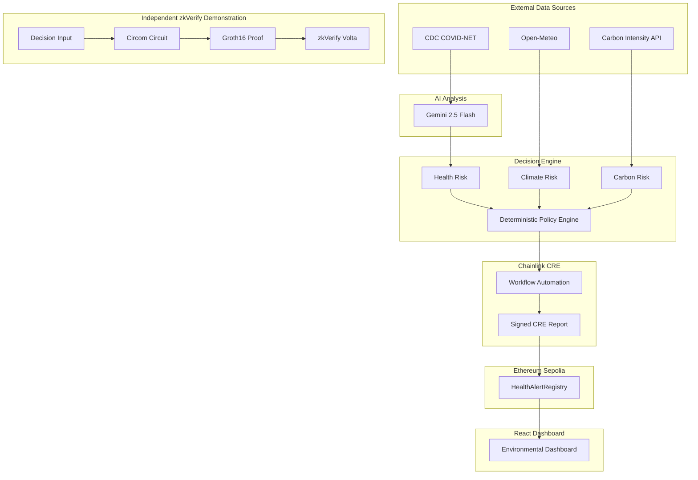

<div align="center">

# TerraGuardian

### AI-powered Environmental Decision Intelligence

Transform real-world environmental signals into transparent, deterministic, and verifiable decision records using AI, Chainlink CRE, Ethereum, and Zero-Knowledge Proofs.

[🌐 Live Demo](https://terra-guardian.vercel.app)

[](contracts/HealthAlertRegistry.sol)
[](frontend/)
[](workflow-environmental-health-intelligence-agent/)
[](workflow-environmental-health-intelligence-agent/workflow.ts)
[](contracts/HealthAlertRegistry.sol)
[](zkverify/)

</div>

---

# Overview

Environmental risks are rarely driven by a single signal.

Public health agencies monitor disease outbreaks.
Weather services monitor extreme climate conditions.
Energy operators publish carbon-emission intensity.

These datasets are typically distributed across different systems, evaluated independently, and lack a transparent decision trail explaining **why** an environmental alert was produced.

**TerraGuardian** explores how modern AI and decentralized infrastructure can work together to improve decision transparency.

The project combines:

- 🤖 AI-assisted health assessment using **Gemini 2.5 Flash**
- 🌍 Live environmental monitoring from multiple public APIs
- ⚙️ Deterministic policy evaluation
- 🔗 Chainlink CRE workflow automation
- ⛓ Ethereum Sepolia on-chain publication
- 🔍 React dashboard for transparent decision visualization
- 🔐 Independent zero-knowledge proof demonstration using Circom, Groth16 and zkVerify

Rather than acting as a production public-health platform, TerraGuardian serves as an **end-to-end technical demonstration** showing how environmental intelligence systems can integrate AI reasoning, deterministic policy evaluation, blockchain transparency and zero-knowledge technologies.

---

# Why TerraGuardian?

Modern environmental decision making faces three common challenges.

## Fragmented Information

Health data, weather conditions and carbon emissions are maintained by different organizations and rarely evaluated together.

## Opaque Decision Processes

AI models may generate useful assessments, but their reasoning is often difficult to audit after a decision has been made.

## Limited Transparency

Many automated systems publish outcomes without preserving how those decisions were produced.

TerraGuardian investigates a different approach:

> Combine AI reasoning with deterministic policy rules, automate execution through Chainlink CRE, record important decisions on Ethereum, and explore how future zero-knowledge proofs could provide additional verifiability.

---

# End-to-End Workflow

```text
┌─────────────────────────────────────────────┐
│          External Data Sources              │
│                                             │
│   CDC     Open-Meteo     Carbon Intensity   │
└─────────────────────────────────────────────┘
                    │
                    ▼
        Gemini AI Health Assessment
                    │
                    ▼
      Environmental Decision Engine
     (Health + Climate + Carbon)
                    │
                    ▼
     Deterministic Threshold Evaluation
                    │
                    ▼
         Chainlink CRE Automation
                    │
                    ▼
     Ethereum Sepolia Smart Contract
                    │
                    ▼
        React Environmental Dashboard
                    │
                    ▼
      Transparent Decision Visualization


          Independent Research Path

 Decision Package
        │
        ▼
   Circom Circuit
        │
        ▼
 Groth16 Proof
        │
        ▼
 zkVerify (Historical Demonstration)
```

The repository currently demonstrates two related but independent technical paths.

**Primary workflow**

External environmental data → AI analysis → deterministic decision policy → Chainlink CRE → Ethereum → React dashboard.

**Independent proof demonstration**

A standalone Circom and Groth16 example demonstrates how zero-knowledge proofs may later be incorporated into environmental decision verification. The current implementation does **not** connect zkVerify to the Chainlink CRE workflow.

---

# System Architecture



The current repository intentionally keeps the blockchain workflow and the zero-knowledge workflow separate.

The implemented production path is:

```
External APIs
      ↓
Gemini Analysis
      ↓
Decision Policy
      ↓
Chainlink CRE
      ↓
Ethereum Sepolia
      ↓
React Dashboard
```

The zkVerify example remains an independent proof-of-concept that demonstrates proof generation and verification without participating in the runtime decision workflow.

---

# Key Features

| Feature | Description |
|----------|-------------|
| 🤖 AI-assisted Health Assessment | Gemini 2.5 Flash evaluates CDC health data and produces structured risk analysis. |
| 🌍 Multi-source Environmental Monitoring | Collects live health, weather and carbon data from public APIs. |
| ⚙️ Deterministic Policy Engine | Applies transparent threshold rules independent of AI reasoning. |
| 🔗 Chainlink CRE Automation | Automates report generation and blockchain publication workflow. |
| ⛓ Ethereum Registry | Demonstrates immutable recording of environmental decision data. |
| 📊 React Dashboard | Visualizes environmental signals and blockchain records. |
| 🔐 Zero-Knowledge Demonstration | Includes an independent Circom + Groth16 + zkVerify example for future integration. |

---

# Project Scope

TerraGuardian demonstrates how several modern technologies can work together within a single environmental intelligence architecture.

Current repository capabilities include:

- AI-assisted environmental risk analysis
- Multi-source data aggregation
- Deterministic decision evaluation
- Chainlink CRE workflow implementation
- Ethereum smart contract integration
- React visualization dashboard
- Independent zero-knowledge proof demonstration

The repository intentionally distinguishes implemented functionality from future work.

In particular, the current version **does not**:

- generate zero-knowledge proofs during workflow execution;
- submit CRE outputs directly to zkVerify;
- use zkVerify results to authorize blockchain publication.

These components are presented as future architectural extensions rather than existing production functionality.

---
# AI Decision Engine

The AI Decision Engine transforms heterogeneous environmental signals into a structured, explainable decision process.

Unlike many AI-powered applications where the language model directly determines the final outcome, TerraGuardian separates **AI reasoning** from **policy enforcement**.

Gemini provides contextual interpretation of public-health data, while deterministic code evaluates whether publication criteria are satisfied.

This design improves transparency because every published decision can be traced back to explicit policy rules rather than relying solely on model output.

---

## Decision Pipeline

```text
CDC COVID-NET
        │
        ▼
 Gemini 2.5 Flash
        │
        ▼
Structured Health Assessment
        │
        ▼
Risk Score + Summary
        │
        ▼
Deterministic Policy Engine
```

Weather and carbon data follow an entirely deterministic path.

```text
Open-Meteo
        │
        ▼
Climate Risk Calculation

Carbon Intensity API
        │
        ▼
Carbon Risk Calculation

        │
        ▼
Deterministic Threshold Evaluation
```

Both paths converge inside the policy engine.

---

## AI Responsibilities

Gemini is responsible for:

- interpreting CDC hospitalization data;
- generating a structured environmental health assessment;
- producing a summarized explanation of observed risk;
- assigning a health risk score.

Gemini **does not**:

- evaluate climate thresholds;
- evaluate carbon thresholds;
- publish blockchain transactions;
- decide whether Ethereum records should be created.

The final publication decision always remains deterministic.

---

## Deterministic Decision Policy

The policy engine evaluates three independent signals.

| Signal | Source | Evaluation |
|---------|--------|------------|
| Health | Gemini assessment | Risk score threshold |
| Climate | Open-Meteo | Temperature and UV policy |
| Carbon | Carbon Intensity API | Carbon intensity policy |

Publication follows a transparent OR policy.

```text
Health Threshold
        │
        ├──────────────┐
Climate Threshold      │
        │              │
        ├──────────────┤
Carbon Threshold       │
        │              │
        ▼              ▼
      Decision Gate (OR)
              │
              ▼
 Publish Report or Skip
```

Only deterministic policy code decides whether publication occurs.

---

## Why Separate AI From Policy?

Many AI systems directly use language-model outputs to trigger downstream actions.

TerraGuardian intentionally separates these responsibilities.

This architecture provides several advantages:

- AI remains responsible for interpretation rather than authorization.
- Decision thresholds remain transparent and versionable.
- Policy behaviour can be audited independently of model changes.
- Deterministic logic produces reproducible decisions.

This separation also makes future governance significantly easier because policy rules can evolve without retraining AI models.

---

# Chainlink CRE Workflow

The environmental workflow is implemented using **Chainlink Runtime Environment (CRE)**.

CRE orchestrates the complete automation pipeline, from data collection to blockchain publication.

---

## Workflow Overview

```text
Fetch Public APIs
        │
        ▼
Validate Responses
        │
        ▼
Gemini Analysis
        │
        ▼
Calculate Risk Scores
        │
        ▼
Decision Policy
        │
        ▼
Generate Signed CRE Report
        │
        ▼
Ethereum Publication
```

The workflow performs every step automatically once execution begins.

---

## Data Collection

The workflow currently collects information from three public sources.

| Source | Purpose |
|---------|---------|
| CDC COVID-NET | Public-health monitoring |
| Open-Meteo | Weather conditions |
| Carbon Intensity API | Electricity carbon intensity |

Each API response is validated before entering the decision pipeline.

Schema validation is performed using **Zod**, preventing malformed responses from propagating through later stages.

---

## AI Analysis

Only CDC data is forwarded to Gemini.

The model returns structured information including:

- environmental health summary;
- health risk score;
- supporting explanation.

Weather and carbon information remain entirely deterministic and never pass through the language model.

---

## Decision Evaluation

After all environmental signals are available, the workflow evaluates the policy engine.

```text
Health Risk
      │
Climate Risk
      │
Carbon Risk
      │
      ▼
Deterministic Decision Engine
      │
      ▼
Threshold Met?
      │
 ┌────┴────┐
 │         │
Yes        No
 │         │
 ▼         ▼
Publish   Skip
```

When no threshold is satisfied, the workflow exits without producing a blockchain report.

---

## CRE Report Generation

If publication is required, the workflow constructs a signed CRE report.

The report contains structured environmental metadata including:

- source;
- region;
- disease;
- health risk score;
- environmental summary.

The payload is ABI encoded before transmission to Ethereum.

---

## Ethereum Publication

After report generation, Chainlink CRE invokes the configured Ethereum receiver.

```text
Decision Passed
        │
        ▼
Generate Report
        │
        ▼
ECDSA Signature
        │
        ▼
Keccak256 Hash
        │
        ▼
writeReport()
        │
        ▼
Ethereum Sepolia
```

The repository demonstrates the complete publication pipeline implemented in workflow code.

---

## Current Implementation Boundary

The current workflow intentionally focuses on deterministic automation.

It currently **does not**:

- generate Circom witnesses;
- generate Groth16 proofs;
- communicate with zkVerify;
- validate zkVerify receipts;
- authorize publication using zero-knowledge verification.

These capabilities are planned as future extensions rather than represented as implemented functionality.

---

# Solidity Smart Contract

Environmental decisions are stored in an Ethereum smart contract deployed on the Sepolia test network.

The contract serves as an append-only demonstration registry for environmental decision records.

---

## Registry Design

The contract defines three independent record types.

| Record | Purpose |
|----------|---------|
| HealthAlert | AI-assisted public-health alerts |
| ClimateAlert | Climate monitoring records |
| EnvironmentalDecisionAlert | Combined environmental decisions |

Each record is permanently stored after publication.

---

## Smart Contract Workflow

```text
CRE Report
      │
      ▼
HealthAlertRegistry
      │
      ├─────────────► HealthAlert
      │
      ├─────────────► ClimateAlert
      │
      └─────────────► EnvironmentalDecisionAlert
```

The current workflow primarily targets the HealthAlert publication path.

The remaining record structures demonstrate how future environmental decision records may be expanded.

---

## Storage Principles

The registry is intentionally simple.

Current characteristics include:

- append-only storage;
- immutable historical records;
- timestamped entries;
- blockchain event emission;
- public read access.

The contract is designed as a demonstration registry rather than a production governance system.

---

## Current Security Scope

The contract intentionally avoids introducing complex authorization logic during this prototype stage.

Current implementation therefore does **not** include:

- role-based access control;
- forwarder authentication;
- replay protection;
- report signature verification;
- zkVerify proof verification.

These security mechanisms are identified as future production improvements rather than omitted accidentally.

---

## Why Use Ethereum?

Ethereum provides three useful properties for environmental decision systems.

### Transparency

Published environmental records become publicly inspectable.

### Immutability

Historical decisions cannot be modified after publication.

### Auditability

Applications can independently reconstruct decision histories without trusting a centralized database.

The current repository uses the **Sepolia** test network to demonstrate these concepts without introducing production infrastructure.

# React Dashboard

The React application provides a transparent interface for exploring environmental signals, blockchain records, and AI-assisted decision outcomes.

Rather than acting as a blockchain wallet or administration console, the dashboard focuses on **decision transparency**—showing users what environmental information is available, how it was evaluated, and what has been recorded on-chain.

The frontend is built with **React 19**, **Vite**, and **ethers.js v6**.

---

## Dashboard Overview

```text
                 React Dashboard

        ┌──────────────────────────┐
        │  Environmental Overview  │
        └─────────────┬────────────┘
                      │
      ┌───────────────┼────────────────┐
      ▼               ▼                ▼

 Health Data     Climate Data     Carbon Data

      │               │                │
      └───────────────┼────────────────┘
                      ▼

            Decision Preview Engine

                      │
                      ▼

          Latest Blockchain Records

                      │
                      ▼

        Historical Environmental Alerts
```

The dashboard combines both live environmental information and previously published blockchain records to present a unified view of environmental decision intelligence.

---

# Dashboard Features

Current functionality includes:

✅ View latest blockchain health alerts

✅ Display current weather conditions

✅ Display current carbon intensity

✅ Preview deterministic decision outcomes

✅ Display historical blockchain records

✅ Display historical zkVerify demonstration metadata

✅ Read blockchain data without wallet connection

---

# Data Sources

The frontend aggregates information from multiple independent sources.

| Data | Runtime Source |
|-------|----------------|
| Health alerts | Ethereum Sepolia |
| Climate alerts | Ethereum Sepolia |
| Live weather | Open-Meteo |
| Carbon intensity | Carbon Intensity API |
| zkVerify metadata | Local demonstration data |

The application intentionally separates **live environmental data** from **historical blockchain records**, allowing users to compare current conditions with previously published decisions.

---

# Decision Preview

One of the dashboard's primary features is the **Decision Preview Engine**.

Instead of executing blockchain transactions, the preview demonstrates how the deterministic policy would evaluate the currently available environmental signals.

```text
Latest Health Record
          │
Current Weather
          │
Current Carbon
          │
          ▼

 Deterministic Policy

          │
          ▼

 Decision Preview
```

This preview exists entirely on the client side and is intended for transparency and educational purposes.

It does **not** represent an actual Chainlink CRE execution.

---

# Blockchain Integration

The dashboard retrieves environmental records directly from Ethereum using **ethers.js**.

```text
Ethereum Sepolia
        │
 JsonRpcProvider
        │
 Smart Contract ABI
        │
        ▼
 React Components
```

No wallet approval is required.

The application performs read-only blockchain queries using a public JSON-RPC provider.

This design allows visitors to explore environmental decision records without connecting MetaMask or signing transactions.

---

# Frontend Architecture

```text
React Components
        │
        ▼
Custom Hooks
        │
        ▼
Service Layer
        │
 ┌──────┼───────────────┐
 ▼      ▼               ▼

Ethereum APIs    Weather APIs   Carbon APIs
```

The application separates presentation logic from blockchain and API communication through reusable hooks and service modules.

---

# Independent zkVerify Demonstration

The repository also contains an independent zero-knowledge proof demonstration.

Unlike the environmental workflow, this component focuses exclusively on demonstrating how Groth16 proofs can be generated and verified.

The current implementation is intentionally isolated from Chainlink CRE.

---

## Demonstration Pipeline

```text
Sample Decision

      │

      ▼

Generate Private Input

      │

      ▼

Circom Circuit

      │

      ▼

Witness

      │

      ▼

Groth16 Proof

      │

      ▼

Verification

      │

      ▼

Historical zkVerify Submission
```

This path demonstrates proof generation and verification independently of the environmental decision workflow.

---

# Circuit Design

The included Circom circuit demonstrates a simple cryptographic statement.

The circuit proves knowledge of a private value whose Poseidon hash equals a public commitment.

```text
Private Secret
        │
        ▼
Poseidon Hash
        │
        ▼
Public Commitment
```

This design intentionally keeps the example small and easy to understand while illustrating the complete Groth16 verification process.

---

# What the Proof Demonstrates

The current proof demonstrates:

✅ Circom circuit development

✅ Poseidon hashing

✅ Witness generation

✅ Groth16 proof generation

✅ Local proof verification

✅ Historical zkVerify submission

---

# Current Boundary

The proof currently does **not** demonstrate:

- environmental policy verification;
- Decision Gate evaluation;
- blockchain authorization;
- AI reasoning verification;
- Chainlink CRE integration;
- automatic proof generation during workflow execution.

Instead, it serves as an independent research prototype illustrating how zero-knowledge proofs could later strengthen environmental decision transparency.

---

# Technology Stack

| Layer | Technology |
|---------|------------|
| Frontend | React 19 |
| Build Tool | Vite |
| Styling | CSS |
| Blockchain Library | ethers.js v6 |
| AI | Gemini 2.5 Flash |
| Workflow Automation | Chainlink CRE |
| Smart Contract | Solidity |
| Blockchain | Ethereum Sepolia |
| Runtime Validation | Zod |
| Zero Knowledge | Circom |
| Proof System | Groth16 |
| zk Verification | zkVerify Volta |
| Language | TypeScript / JavaScript |

---

# Repository Structure

```text
TerraGuardian
│
├── contracts/
│   └── Solidity smart contracts
│
├── frontend/
│   └── React dashboard
│
├── workflow-environmental-health-intelligence-agent/
│   └── Chainlink CRE workflow
│
├── shared/
│   └── Shared decision policy
│
├── zkverify/
│   ├── Circom circuit
│   ├── Groth16 proof
│   ├── Verification scripts
│   └── Historical submission
│
└── docs/
    └── Project documentation
```

---

# Getting Started

## Clone Repository

```bash
git clone https://github.com/<your-account>/TerraGuardian.git

cd TerraGuardian
```

---

## Run Frontend

```bash
cd frontend

npm install

npm run dev
```

The dashboard will be available locally through the Vite development server.

---

## Build Frontend

```bash
npm run build
```

---

## Chainlink CRE Workflow

```bash
cd workflow-environmental-health-intelligence-agent

npm install

npm run typecheck

npm run build
```

A valid Gemini API key is required when running workflow simulations.

---

## Verify Existing Groth16 Proof

```bash
cd zkverify

npm install

npm run verify
```

This command verifies the proof included in the repository.

---

## Regenerate Sample Input

```bash
npm run generate:input
```

This regenerates the fixed demonstration input used by the example circuit.

---

## Submit Demonstration Proof

```bash
SEED_PHRASE="your seed phrase"

npm run submit
```

The submission script demonstrates how the existing proof can be submitted to the zkVerify Volta test network.

Sensitive credentials should always be supplied through environment variables and must never be committed to source control.

